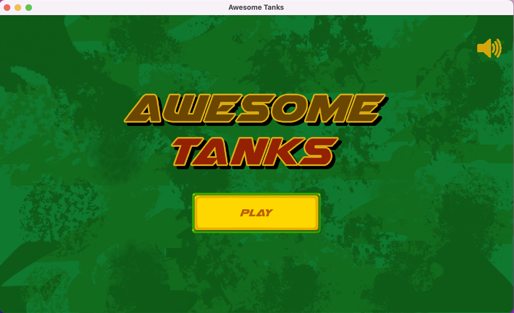
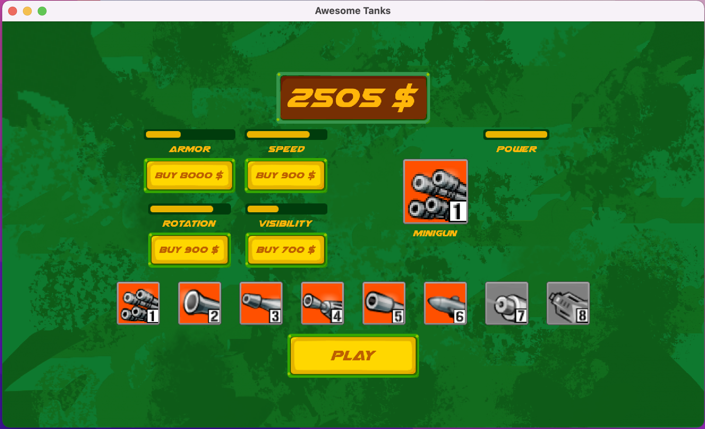
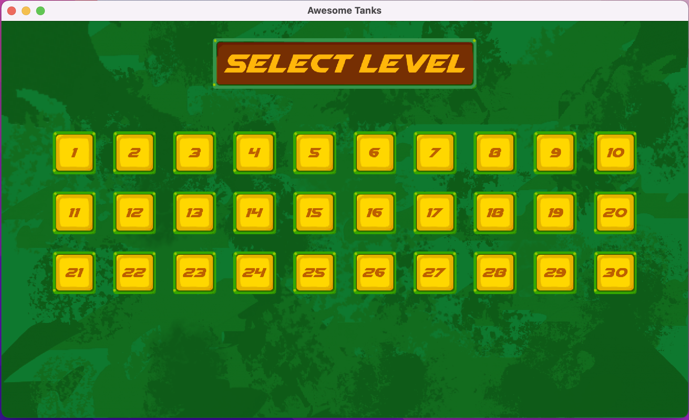
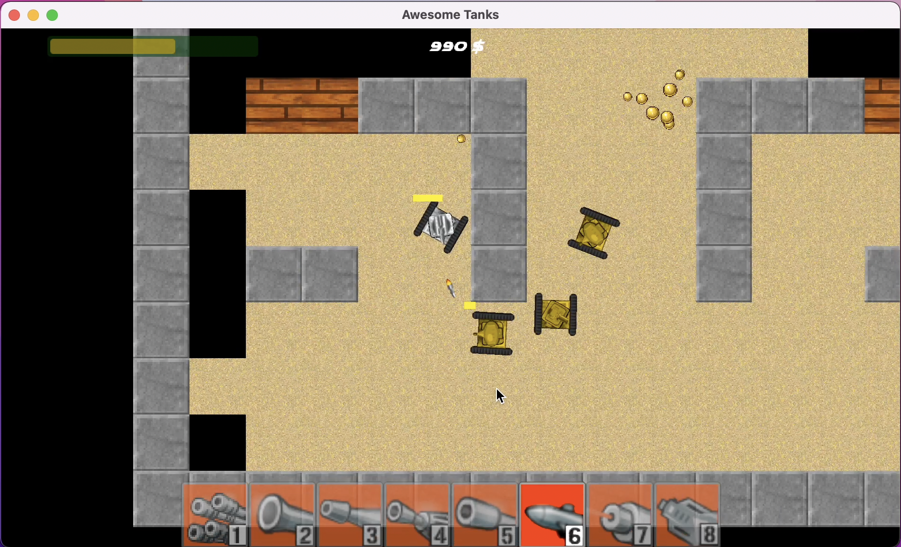
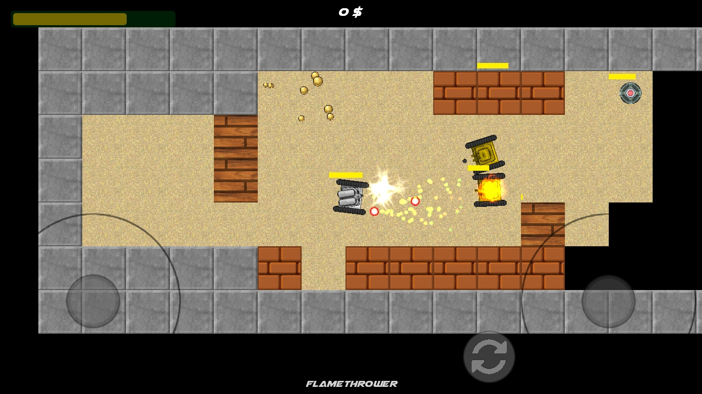

# AwesomeTanks
Android and desktop game based on the popular flash game 'Awesome Tanks' made with the LibGDX library for cross-platform games in Java. The project was started in late 2015 but it was never completed. Now that I have time I decided to include the proper modifications to make it enjoyable.

## Main Screen

## Upgrades Screen
In this screen you can buy new weapons or upgrades for your tanks. There are currently 8 unique weapons available.

## Levels Screen
There are currently 30 unique levels included with increassingly difficult enemies and maps.

## Game Screen
The player is controlled using the WASD keys and the mouse to aim. To select a weapon you can click on the bottom menu containing the available weapons or you can click the 1-8 keys to select one.

The progress bar at the top left displays the remaining ammunition of the selected gun. The label at the top displays the profit earned at the moment in that specific game.

In the mobile version the player is controlled using 2 joysticks. The one on the left is used to move around the player. The one on the right is used to aim at enemies. In order to shoot one must bring the joystick knob to the edge. This is designed this way instead of using an additional button to allow the user to shoot, aim and move at the same time.

The button to the right of the aim joystick is used to open the "gun menu" to allow the user to switch between the available guns.

